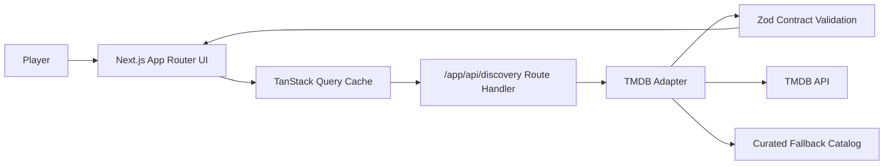

# Film Forage 2.0

Film Forage is a modern cinematic discovery product designed for fast exploration, strong visual hierarchy, and resilient fallback behavior.

## Highlights
- Mood + genre + runtime guided discovery.
- Fast shortlist loop with clear action feedback.
- Contract-first data handling (Zod) from adapter to UI.
- Server-only secret policy and graceful provider fallback.

## Architecture


## Deployment Model
- Platform: Vercel (production)
- Branch strategy: `master` auto-promotes to production
- Previews: feature branch and PR previews when Git integration is active

## Tech Stack
- Next.js 16 App Router
- React 19 + TypeScript strict mode
- TanStack Query v5
- Zod v4
- Tailwind CSS v4
- Vitest + Playwright

## Local Development
```bash
pnpm install
pnpm dev
```

## Quality Gates
```bash
pnpm run check
pnpm run test:e2e
pnpm run audit:high
pnpm run docs:check
```

## Environment
Copy `.env.example` to `.env.local`.

- `TMDB_ACCESS_TOKEN` server-only token for live TMDB requests.
- `TMDB_BASE_URL` optional TMDB base override.

Security rule: do not place secrets in `NEXT_PUBLIC_` variables.

## Troubleshooting
- If live discovery fails, confirm `TMDB_ACCESS_TOKEN` in Vercel env for production.
- If docs CI fails, run `pnpm run docs:check` locally and fix Mermaid/markdown issues.
- If stale data appears, use the in-app refresh control to refetch.
