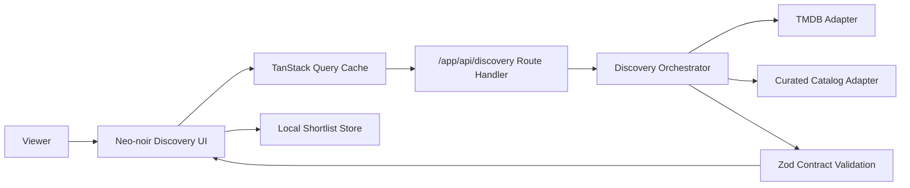

# Film Forage - Neo-Noir Editorial Discovery

Film Forage is a premium cinematic discovery experience rebuilt with a zero-legacy architecture: intent-driven filtering, card-based exploration, and a ranked shortlist loop.

## Product Value
- Emotional intent filters (`mood`, `genre`, `runtime`) that shape recommendation lanes.
- Embla-driven discovery deck with save-to-shortlist momentum.
- Drag-rank shortlist board for planning watch order.
- Editorial collection pages and title briefings tied to normalized contracts.

## Experience Map
- `/` discovery stage
- `/title/[id]` title briefing
- `/shortlist` ranked shortlist hub
- `/collections/[slug]` curated collection narrative

## Architecture


## Deployment Model
- Platform: Vercel
- Production branch: `master`
- PR branches: preview deployments when Git integration is connected

## Security Posture
- `TMDB_ACCESS_TOKEN` is server-only.
- No `NEXT_PUBLIC_` secrets.
- CSP and security headers enforced in [`next.config.ts`](/Users/aib/Desktop/Development/Projects/_rewrites/film-forage/next.config.ts).

## Environment
Copy `.env.example` to `.env.local`.

- `TMDB_ACCESS_TOKEN` required for live discovery.
- `TMDB_BASE_URL` optional override.

## Local Development
```bash
pnpm install
pnpm dev
```

## Quality Gates
```bash
pnpm run check
pnpm run test:e2e
pnpm run audit:high
pnpm run docs:check
```

## Troubleshooting
- If TMDB fails, curated fallback should continue delivering cards.
- If shortlist state appears stale, clear local storage and refresh.
- If docs checks fail, run `pnpm run docs:check` and correct markdown/Mermaid syntax.
