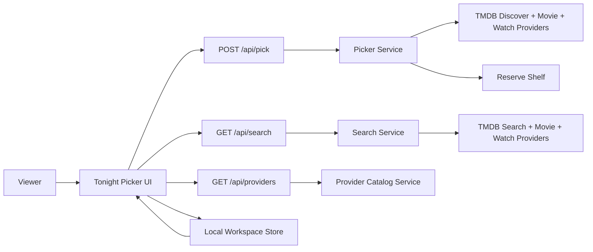

# Film Forage | Pick Tonight's Movie

Film Forage is a practical movie-picking tool built for one job: help you decide what to watch tonight without spiraling through tabs, streaming apps, and half-remembered titles.

It uses TMDB for live movie discovery, title lookup, detail pages, recommendations, and watch-provider data. Saved picks, notes, hidden titles, and recent searches stay local in the browser for this phase.

## Product Value
- `Tonight picker` for region, runtime, service, genre, and vibe filtering.
- `Best match` plus honest backup rows instead of an endless decorative deck.
- `Direct title search` for when you already know the neighborhood.
- `Local-first watchlist` with private notes and clean export.
- `Source guide` that explains live data, regional limits, and reserve-shelf fallback behavior plainly.

## Routes
- `/` tonight picker
- `/search` title lookup
- `/movie/[id]` live movie detail
- `/watchlist` local saved picks and notes
- `/sources` provenance, attribution, and limits

## Architecture


## Data Truth
- Live movie data comes from TMDB.
- Watch availability comes from TMDB's JustWatch-backed provider data.
- The app does not invent confidence scores or fake curator rationale.
- If live data is unavailable, Film Forage explicitly switches to a small reserve shelf and marks availability as unknown.

## Environment
Copy `.env.example` to `.env.local`.

- `TMDB_ACCESS_TOKEN` required for live TMDB fetches. Without it, the app falls back to the reserve shelf.
- `TMDB_BASE_URL` optional override.

## Local Development
```bash
pnpm install
pnpm dev
```

## Quality Gates
```bash
pnpm run check
pnpm run test:e2e
pnpm run audit:high
pnpm run docs:check
```

## Operations Notes
- The launch region defaults to `US` and is user-editable.
- Provider filters can disappear temporarily when TMDB provider data is unavailable.
- Local notes, hidden picks, saved movies, and recent searches stay in-browser only for this phase.

## Attribution
- [TMDB](https://www.themoviedb.org/)
- [JustWatch](https://www.justwatch.com/)
