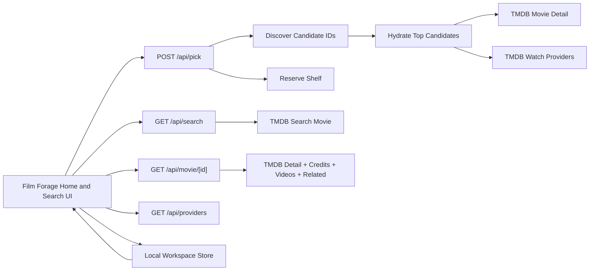

# Film Forage Architecture v4

## Runtime Boundaries
- Next.js App Router with server components by default.
- Client components only for picker interactions, local watchlist actions, and selective motion.
- Zod contracts at all internal API boundaries.
- Local-first browser storage for watchlist state and recent user context.

## Topology

## Core Contracts
- `PickRequestVM`
  - `region`
  - `providers[]`
  - `runtimeMax`
  - `genre`
  - `vibe`
  - `availabilityMode`
  - `excludeIds[]`
- `MovieMatchCardVM`
  - `id`
  - `title`
  - `year`
  - `runtimeMinutes`
  - `genres[]`
  - `overview`
  - `providerSummary`
  - `fitReasons[]`
  - `provenance`
- `MovieDetailVM`
  - `card`
  - `tagline`
  - `releaseDate`
  - `spokenLanguages[]`
  - `trailerUrl`
  - `cast[]`
  - `recommendations[]`
  - `similar[]`
  - `provenanceNote`
- `WorkspaceVM`
  - `savedMovies[]`
  - `dismissedMovieIds[]`
  - `recentSearches[]`
  - `region`
  - `providerIds[]`

## Truthfulness Rules
- Card claims must trace to selected filters or live TMDB fields.
- No synthetic confidence percentages.
- No fake curator rationale.
- Missing provider data is shown as unknown, not inferred.
- Reserve-shelf cards are explicitly labeled and never presented as live availability.

## Caching and Revalidation
- TMDB discover and search requests revalidate on short windows.
- Movie details and provider summaries revalidate on longer windows.
- Local watchlist state is browser-only and not synchronized server-side.

## Security Notes
- `TMDB_ACCESS_TOKEN` remains server-only.
- If `TMDB_ACCESS_TOKEN` is missing or invalid, the picker and detail flows degrade to the reserve shelf instead of guessing live availability.
- CSP and security headers are enforced globally.
- No `NEXT_PUBLIC_` secrets are used.
