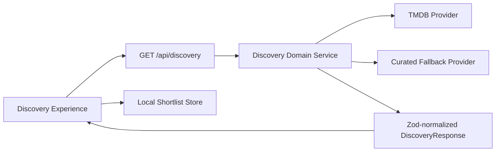

# Film Forage Architecture v3

## Runtime Boundaries
- Next.js App Router + TypeScript strict mode.
- Tailwind + Radix + CVA primitives for UI composition.
- TanStack Query for feed caching and refetch control.
- Route contracts validated with Zod.

## Topology

## Core Contracts
- `DiscoveryResponse`
  - `items[]`
  - `meta.source`
  - `meta.fallbackUsed`
  - `meta.confidence`
  - `meta.freshnessHours`
  - `meta.partialData`
  - `meta.generatedAt`

## Error and Failure Semantics
- `unavailable`: live adapter unavailable, fallback path engaged.
- `invalid_payload`: provider payload rejected by schema parser.
- `partial`: subset of item fields available.
- `stale`: freshness threshold exceeded.
- `rate_limited`: upstream provider throttling.

## Security Notes
- TMDB token is never exposed to the client bundle.
- Global CSP and security headers enforced.
